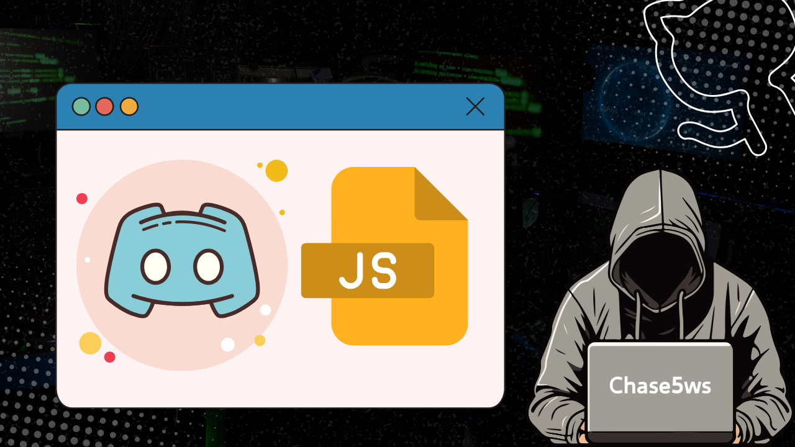

# Discord Channel Sync Bot




---

## 專案說明

**Discord Channel Sync Bot** 是一款專為 Discord 頻道訊息同步設計的 Node.js 機器人。  
本機器人可自動將指定來源頻道的訊息（包含圖片）同步至目標頻道，並支援訊息編輯同步，適合需要跨頻道公告、備份或自動轉發訊息的社群。

---

## 功能特色

- **多頻道監聽**：可同時監聽多個來源頻道。
- **同步圖片與文字**：自動同步訊息內容及圖片附件。
- **訊息編輯同步**：來源訊息被編輯時，目標頻道訊息也會自動更新。
- **（選用）訊息刪除同步**：可選擇同步刪除動作（程式內有註解範例）。
- **Keep-Alive 伺服器**：內建 HTTP 伺服器，方便部署於 Replit、Glitch 等平台防止自動休眠。
- **簡單設定**：僅需編輯 `config.json` 即可快速上線。

---

## 安裝指南

1. **下載專案**
   ```bash
   git clone <你的專案網址>
   cd <專案資料夾>
   ```

2. **安裝相依套件**
   ```bash
   npm install
   ```

3. **設定 `config.json`**
   在專案根目錄建立 `config.json`，內容範例如下：
   ```json
   {
     "token": "你的 Discord Bot Token",
     "CHANNEL_LISTEN": ["來源頻道ID1", "來源頻道ID2"],
     "CHANNEL_POST": "目標頻道ID"
   }
   ```
   - `token`：你的 Discord Bot Token
   - `CHANNEL_LISTEN`：要監聽的來源頻道 ID 陣列
   - `CHANNEL_POST`：要同步發送的目標頻道 ID

4. **（選用）keep_alive.js**
   可建立 `keep_alive.js` 以防止平台自動休眠，內容如下：
   ```js
   var http = require('http')
   http.createServer(function (req, res) {
     res.write("I'm alive");
     res.end();
   }).listen(8080);
   ```

---

## 啟動方式

- 直接啟動
  ```bash
  node index.js
  ```

- **後台運行（推薦）**
  1. 安裝 pm2（全域）
     ```bash
     npm install pm2 -g
     ```
  2. 啟動機器人
     ```bash
     pm2 start index.js --name my-discord-bot
     ```
  3. 停止機器人
     ```bash
     pm2 stop my-discord-bot
     ```
  4. 重啟機器人
     ```bash
     pm2 restart my-discord-bot
     ```

---

## 權限與邀請

**機器人權限設定：**
- PRESENCE INTENT
- SERVER MEMBERS INTENT
- MESSAGE CONTENT INTENT  
  *請於 Discord 開發者後台將上述 intents 全部打開*

**邀請連結格式：**
```
https://discord.com/api/oauth2/authorize?client_id=your_APPLICATION_ID&permissions=8&scope=bot%20applications.commands
```
將 `your_APPLICATION_ID` 替換為你的 Bot 應用程式 ID。

---

## 權限代碼

- 監聽頻道的權限代碼：`1024`
- 發送頻道的權限代碼：`17600776236032`

---

## 使用情境

- 跨頻道公告同步
- 多伺服器資訊轉發
- 社群自動備份訊息
- 圖片或多媒體內容自動同步

---

## 檔案結構

- `index.js`：主程式，負責訊息監聽與同步
- `config.json`：Bot 設定檔（**請勿公開 token**）
- `keep_alive.js`：keep-alive 伺服器（可選）

---

## 注意事項

- 請確保 Bot 已加入目標伺服器並擁有足夠權限（讀取、發送、讀取訊息內容、管理訊息等）
- 若要啟用訊息刪除同步，請依程式內註解操作
- 若於 Replit、Glitch 等平台部署，請確認 keep_alive.js 已正確啟動

---

## 授權

MIT License

---

> 本專案僅供學術與學習用途，如需商業應用請自行評估風險。
